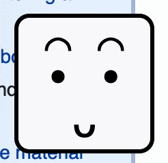
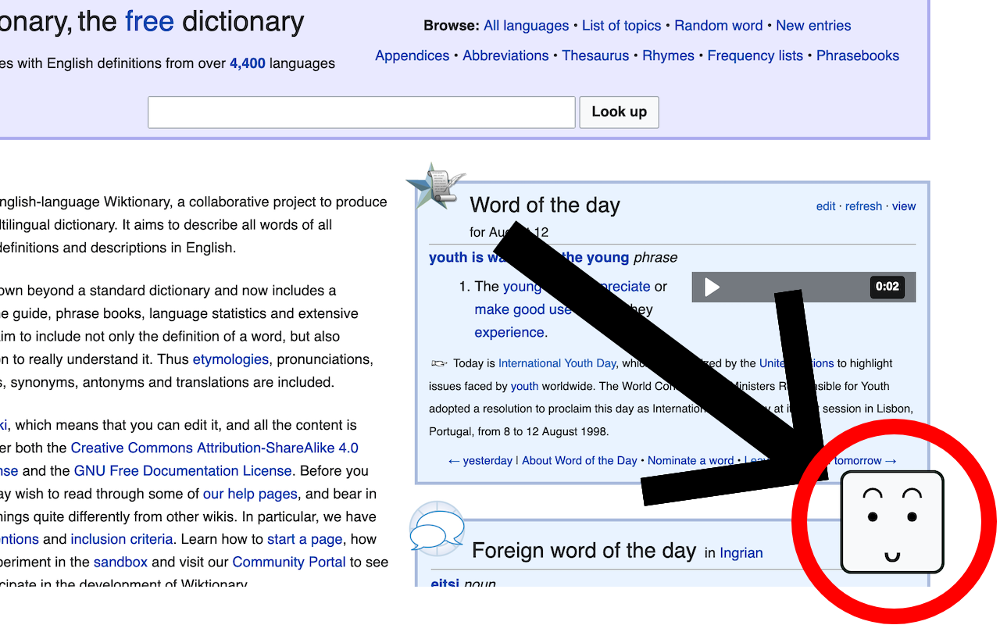

# togglavatar

Use microphone volume to toggle an avatar in your browser.

[Chrome extension](https://chromewebstore.google.com/detail/togglavatar/cajmjacgimaodainnbocljkhkoinjgcb) / [Firefox add-on](https://addons.mozilla.org/firefox/addon/togglavatar)

Just one of the things I'm learning/building. https://github.com/hchiam/learning

This browser add-on/extension automatically shows an avatar even if you refresh the page or navigate, which can use volume to toggle the styling of the avatar that is displayed.

Notes and templates:
- [learning-firefox-extension](https://github.com/hchiam/learning-firefox-extension) (e.g.: about:debugging and Extension ID = GUID for browser_specific_settings.gecko.id in manifest.json)
- [tutorial.hello-world template](https://github.com/GoogleChrome/chrome-extensions-samples/tree/dc2174377a6542895cbcb7f636f85e5d3d156be8/functional-samples/tutorial.hello-world)
- [urlvoid-firefox-extension](https://github.com/hchiam/urlvoid-firefox-extension)

This browser add-on/extension uses shared variables/functions in shared.js in the page.js via the manifest.json, and in the popup.js via the popup.html file.
